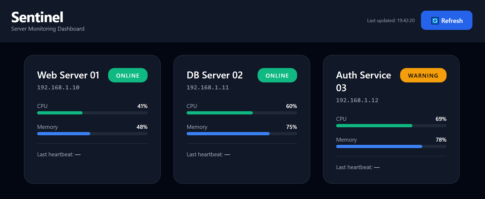

# Sentinel — Server Monitoring Dashboard

**Rebuild of my IHK Abschlussprojekt (Fachinformatiker für Anwendungsentwicklung, 2025)**

A full-stack application for real-time monitoring of servers in an IT service environment.  
It collects system metrics, heartbeats and errors from multiple servers and displays them in a clean dashboard.

## Features
- Real-time server status overview (CPU, memory, disk usage, heartbeats)
- Centralized error logging with severity levels
- Microservice-style architecture (Scout → Sentinel Backend → Dashboard)
- Responsive Vue 3 dashboard with Tailwind CSS
- REST API built with Spring Boot

## Tech Stack
**Backend**
- Java 17 + Spring Boot 4.0
- Spring Data JPA + H2

**Frontend**
- Vue 3 + Vite
- Tailwind CSS

## Screenshots

## Project Background
This is a complete rebuild of my original IHK final project "Sentinel – Serverüberwachung".
The goal was to create a monitoring tool that helps detect and respond to server issues faster.
